# Solar Roof Toolkit


> End-to-end Swiss solar panel detection from canton-scale building discovery to per-roof AI segmentation and multi-model panel detection.


 [Full walkthrough (slides):](assets/Zero_to_Solar.pdf) dataset comparison, coordinate geometry, relief displacement, and the SAM3 debugging story

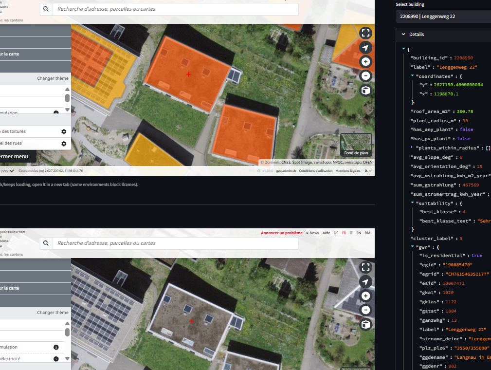

---

## What This Does

This toolkit automates the full pipeline for identifying buildings with or without solar panels across Switzerland, using public GeoAdmin data and a stack of vision AI models:

1. **Discovers buildings** at region or canton scale via GeoAdmin WMS/MapServer, with residential and PV filtering
2. **Captures aerial screenshots** of each building using Swiss orthophoto tiles
3. **Segments the roof** using SAM3 with internal ViT-H feature scoring (PC1 contrast) so no external guidance model needed
4. **Detects solar panels** using YOLO, OpenAI Vision, Gemini, or Ollama, with automatic retry across models
5. **Visualises results** in an interactive Streamlit dashboard with per-building inspection
6. **Excel report** if needed export results to Excel as a report

---

## Technical Highlights


### SAM3 Mask Selection via Internal Layer-23 PC1 Feature Scoring & Spatial Priors

#### The problem was solved in 4 iterations:


**Iteration 1: External guidance (DINOv2):** My original approach used DINOv2 as external guidance but I got sometimes good results sometimes bad. (I also tried DINOv3 but same issue)

How it was working: I used cosine similarity 
heatmaps to generate a bounding box prompt for SAM3. Selected the right region 
more often, but still couldn't reliably segment the building.

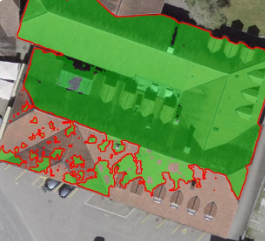

*SAM3 + DINOv2 was not segmenting fully in such examples.*

**Iteration 2: SAM3 internal PC1 + recall:** 

So I started to debug much deeper. During debugging, both models DINOv2 and SAM3 gave `pc1_coverage = 1.0` for the top-ranked mask. That saturation was the clue: if any spatial prior reaches 1.0, the formula `SAM3_score × precision` degrades to just `SAM3_score`, and the external model contributes nothing. The problem wasn't the guidance model actually, rather it was the scoring formula.

So I dropped external models entirely.
Used SAM3's own layer-23 features (PC1, 56.8% of token variance) to score masks by how much of the semantic "hot zone" they cover. Solved the issue of not segmenting correctly, but PC1 recall alone still picked the wrong wing when SAM3 split a building into per-wing queries.

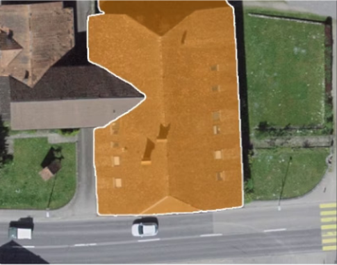

*Only left wing was chosen*

**Iteration 3**: To understand why, I hooked into SAM3's decoder cross-attention (`transformer.decoder.layers[5].cross_attn`, shape `(1, 8 heads, 201 queries, 5184 image tokens)`) and visualised the attention maps for rank 1 vs rank 2, rank 3.. etc. The result was clear: SAM3's decoder was splitting buildings into per-wing queries by design, and the more uniform sub-region naturally scores higher. No spatial prior based on *precision* (is this mask in the right place?) can fix that.

Current precision, $\frac{|\text{mask} \cap \text{hot}|}{|\text{mask}|}$, saturates at $1.0$ when the mask is entirely inside the warm zone. This means Rank 1 (a subset of the building) gets the same precision as Rank 2 (the whole building). 

What I needed was **recall**, $\frac{|\text{mask} \cap \text{hot}|}{|\text{hot}|}$, so that it rewards masks that cover more of the semantically hot region.


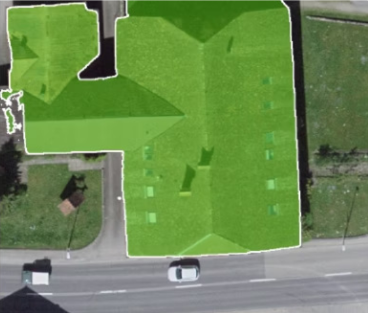

*Finally all building with left and right wing was chosen*

The mask score was:

```
score = SAM3_score × PC1_recall × center_score
```


**Iteration 4**: However, it was not enough. The model was supposed to choose the building in the middle!

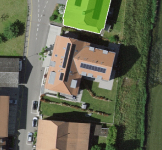

*The model was supposed to choose the building in the middle*

So I have debugged again and looking at the candidates: **rank 1 (s=0.177)** is the large L-shaped central building with the tiled roof and solar panels. **Rank 2 (s=0.160)** is the top building. SAM3's language model scored rank 1 higher for the main building likely because:

It was larger (9% vs 7.4% of image)
It was centrally located so language-vision models tend to weight central objects for prompts like "the main"

Therefore for a 50% hot zone, a 9% mask should have reached **~18% recall** if it perfectly overlapped the hot zone. Rank 1 only reached **2.8%**, meaning the large center building was sitting almost entirely in the cold zone. Rank 2 (7.4% mask) reached **5.4%** slightly less cold.

Both are terrible recall values. Neither mask meaningfully overlapped the hot zone. The 2x difference between 0.028 and 0.054 was pure noise the signal-to-noise ratio had effectively vanished, leaving only random overlap variation. Multiplying SAM3 score by this noise caused the ranking to flip from correct to wrong.

So:

SAM3 score alone:  rank1=0.1766  rank2=0.1595  → correct pick ✓

After × pc1_noise: rank1=0.0046  rank2=0.0086  → wrong pick ✗

The PC1 recall isn't good at choosing between different buildings, SAM3's language grounding already does that. PC1 recall is good at choosing which mask of the same building to use (e.g., rank 1 might have 3 mask proposals of the same building at different extents, PC1 picks the fullest one).

A safer formula would only let PC1 re-rank within a confidence band of the top SAM3 score, not across clearly different buildings where `center_score` is a Gaussian proximity weight biasing toward centered building targets. When PC1 is degenerate (recall < 0.15), scoring falls back to `SAM3_score × center_score` for scale-agnostic robustness.

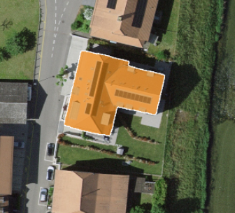

*After: the correct building is selected in 15/16 validation cases, with correct override of SAM3 rank 1 in the remaining case.*


**The solution combines 3 signals:**

**1. SAM3 Score**: language model confidence for `"the main building"`.  
Good baseline, but degrades when a bright or large neighbour scores higher than the target.

**2. L23 PC1 Recall**: SAM3's own layer-23 features projected to PC1  
(the dominant semantic axis, explaining 56.8% of token variance).  
PC1 naturally separates building from background. Rather than asking *"is this mask
in the right place?"* (precision), we ask *"does this mask cover the full building?"*
(recall). Tokens are captured during the normal SAM3 forward pass, zero extra cost.

**3. Center Score**: Gaussian proximity to image centre.  
Hard domain guarantee: every aerial crop is centred on the target building.
This single signal fixed the most persistent failure case, an off-centre bright
neighbour winning despite a competitive SAM3 score.

The final mask score is:
```
combined = SAM3_score × PC1_recall × center_score
```

**Fallback:** when PC1 is degenerate (scattered car-roof reflections, max recall < 15%),
the formula reduces to `SAM3_score × center_score` so the center prior still applies.

**Performance:** Eliminated a redundant ViT-H backbone pass by registering the L23 hook once before the processing loop. `processor.set_image()` triggers the backbone as a side effect, so tokens are already captured when scoring runs, no second forward pass needed. ~1.8× speedup per image.

---


#### Detection Results Comparison

| YOLO Raw Detection | YOLO Detection Success | Gemini Reasoning |
|-------------------|------------------------|------------------|
| 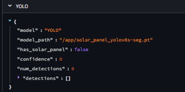 | 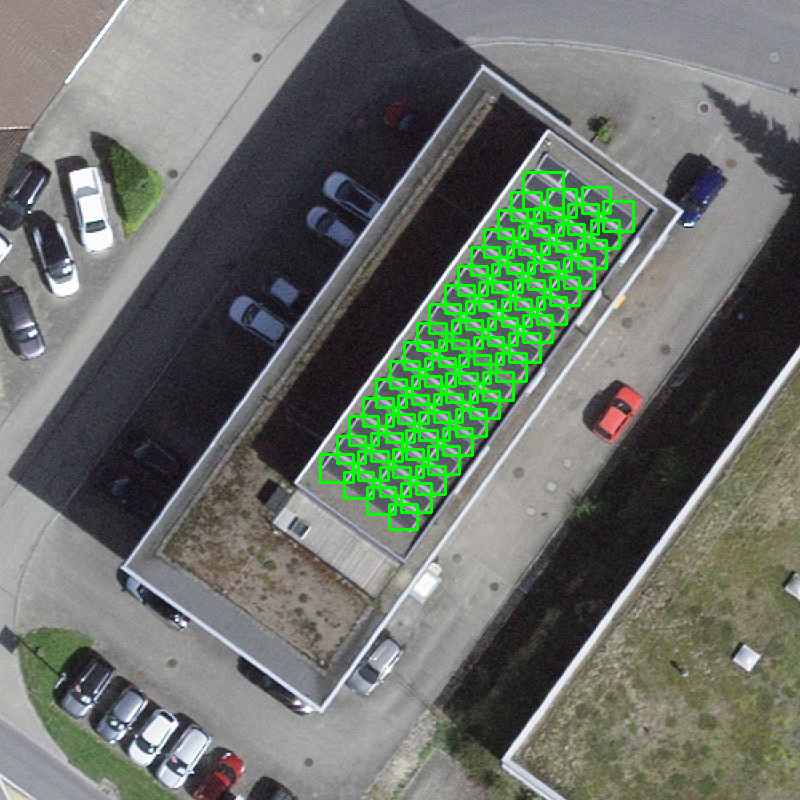 | 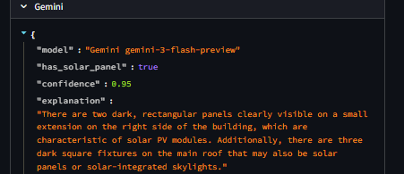 |

*Figure: Left shows YOLO's bounding box detection, middle shows successful YOLO solar panel detection, right shows Gemini's advanced reasoning and context analysis*


#### SAM3 Segmentation Example

| SAM3 Mask Output | SAM3 Normalized Features | Result |
|------------------|--------------------------|-----------------------------|
| 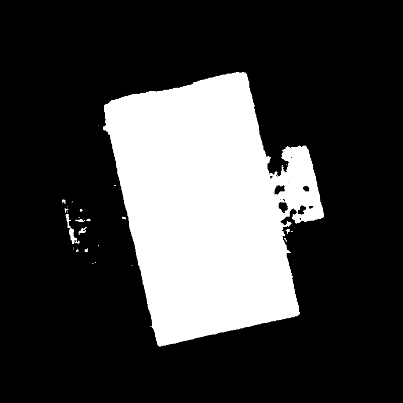 | 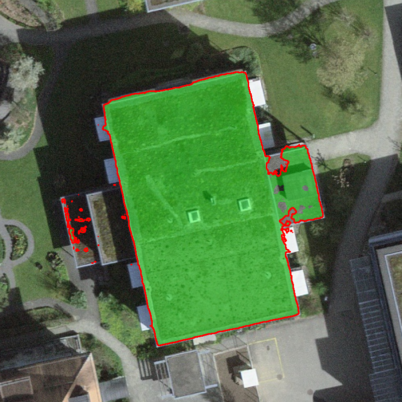 | 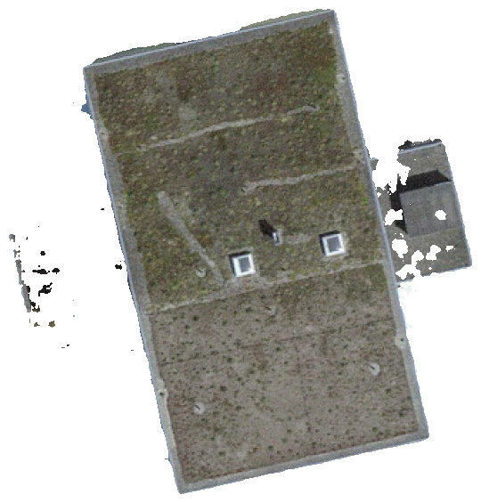 |

*Figure: SAM3 segmentation for precise roof boundary detection*


---

After SAM3 crops and isolates the target building, YOLO operates only on that region, wrong-building detections are structurally near impossible.


### Domain Challenges & Data Quality


#### APIs Used

- **SearchServer** (geocode) - Address to LV95 coordinates conversion
- **GWR ch.bfs.gebaeude_wohnungs_register** (building) - Official building registry with EGID, address, type
- **Power plants ch.bfe.elektrizitaetsproduktionsanlagen** (identify) - Solar/wind/hydro plant registry  
- **Solar ch.bfe.solarenergie-eignung-daecher** (solar) - Roof facet solar suitability data
- **WMS satellite image** (wms-url) - Swiss aerial orthophoto tiles
- **Image date metadata** (image-date) - Flight year and resolution of aerial images
- **Reverse geocoding** - Building address lookup via GWR layer identify

Working with Swiss GeoAdmin data surface several non-obvious problems that required careful handling:

**API data lag.** The `has_pv_plant` field returns `false` for buildings with visible solar panels when the installation hasn't been administratively registered yet. This is why visual detection can't be skipped even when the API suggests no panel exists, it was discovered using a real building, where the API was wrong but YOLO caught it.

**EGRID/ESID/EGID Definitions.** This pipeline relies on a specific hierarchy of Swiss identifiers to ensure data integrity:
* **EGID (Federal Building ID):** A unique physical building identifier nationwide from the GWR (Federal Building Register).
* **EGRID (Federal Grounds ID):** Identifies the land register parcel. Multiple buildings or addresses (e.g., 8 units at "Bäraustrasse 71") often share one EGRID.
* **ESID (Federal Street Address Entry ID):** A unique identifier for the specific street address entry.

**Deduplication.** Naive deduplication by EGRID alone would silently merge unrelated buildings. The pipeline deduplicates by both ESID and EGRID, with configurable GWR attribute matching to ensure we don't skip valid roof targets.

**GKAT classification noise.** Building category codes don't always match what's on the ground. A GKAT 1040 (pure residential) building turned out to be a large industrial structure. Visual confirmation via the SAM3 + YOLO pipeline catches these misclassifications.

**Relief displacement.** Aerial orthophotos exhibit radial shift caused by building height:

$$d = \frac{r \cdot h}{H}$$

Since Swiss GeoAdmin doesn't expose true orthophoto data via API and the flying height $H$ isn't published, the shift can't be corrected analytically. SAM3's prompt-based segmentation is robust to this because it segments by visual content rather than relying on registered coordinates.


### Async Performance
| Bottleneck | Approach | Speedup |
|---|---|---|
| Screenshot downloads | `asyncio.gather` + `Semaphore(5)` to be kind, concurrent facet/metadata/satellite | ~166× |
| Building tile querying | Async worker pool with `asyncio.Queue`, O(1) set lookups | ~6× |
| SAM3 backbone | Single ViT-H pass via hook, token reuse | ~1.8× |

### Multi-Model Detection with Retry Logic

`detect_solar_panels.py` supports YOLO (local), OpenAI Vision, Gemini, and Ollama. Failed detections automatically retry across fallback models, with configurable delays to handle API rate limits.


## Setup

```bash
# Clone and install (uv recommended)
uv sync

# Or with pip
pip install -r requirements.txt
```

**Model weights & API keys** (add to `.env`):

```
OPENAI_API_KEY=...
GOOGLE_API_KEY=...
OPEN_ROUTER_API_KEY=...
```

- YOLO weights: place `solar_panel_yolov8s-seg.pt` in the project root
- SAM3 weights download automatically on first run of `feature_guided_sam3.py`

---

## Scripts

### 🚀 **Unified Pipeline** `run_pipeline.py`
**Recommended for most users** - Runs the complete end-to-end pipeline in one command.

**Pipeline Stages:**
1. `region_building_groups.py` – discover buildings in a region/canton
2. `get_building_wms_overlay.py` / `get_building_screenshot.py` – take aerial screenshots (WMS overlay preferred)  
3. `feature_guided_sam3.py` – segment buildings (SAM3)
4. `crop_and_clean_image.py` – crop & isolate each building
5. `detect_solar_panels.py` – detect solar panels
6. `export_to_excel.py` – export results to Excel (not in pipeline currently)

**View Results in Streamlit:**
After pipeline completion, go to `streamlit_site/app.py` and update the directory paths at the top:

```python
PREVIEW_JSON = "streamlit_site/your_region/your_buildings.json"
SCREENSHOT_DIRS = ["streamlit_site/your_region/screenshots"]
DETECTIONS_BATCH_JSON = "streamlit_site/your_region/your_detections.json"
YOLO_VIZ_DIRS = ["streamlit_site/your_region/detection_viz"]
```

Then run the Streamlit app:

```bash
cd streamlit_site
streamlit run app.py --server.port 8501 --server.address 0.0.0.0
```

**Details:**
```bash

# Full pipeline for a municipality
python3 run_pipeline.py --region "Bern"

# Skip stages you already ran (resume)
python3 run_pipeline.py --region "Bern" --start-stage 3

# Dry-run: just print what would be executed
python3 run_pipeline.py --region "Bern" --dry-run

# Override specific stage parameters
python3 run_pipeline.py --region "Payerne" \
  --min-roof-area 200 \
  --screenshot-size-m 40 \
  --detection-models yolo,gemini,openai,ollama \
  --sam-guide dino

# Custom pipeline with specific stages and limits
python3 run_pipeline.py --region "Bern" \
  --start-stage 1 --stop-stage 5 \
  --limit 100 \
  --min-roof-area 300.0 \
  --plant-radius 30.0 \
  --filter-mode all \
  --pv-only-plants \
  --max-results 2000 \
  --residential-only

# Canton examples
python3 run_pipeline.py --region "Zurich" --canton-level --max-results 1500
python3 run_pipeline.py --region "Vaud" --canton-level --residential-only
python3 run_pipeline.py --region "Geneva" --canton-level --start-stage 2
```


## Tips
- Large downloads (SAM3) happen on first run; ensure GPU if using `--device cuda`.
- GeoAdmin calls can rate limit; use `--sleep-s` and `--progress-every-pct` to throttle.
- Keep heavy outputs in ignored dirs (`sam3_outputs/`, `feature_guided_outputs/`, etc.).
